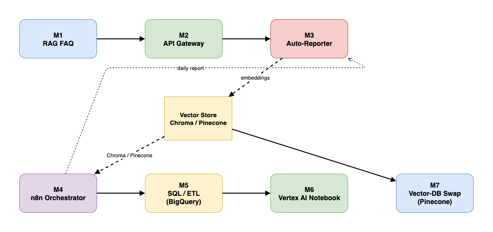
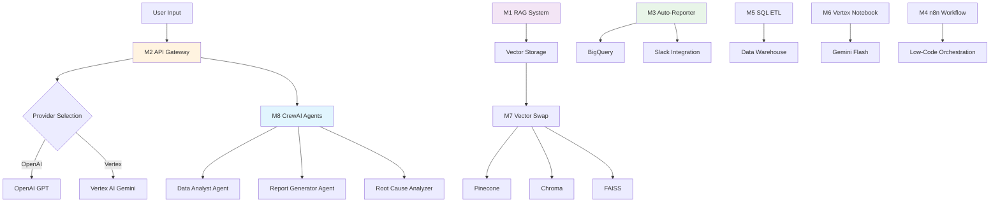
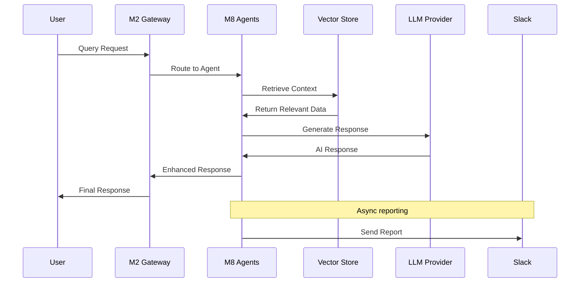
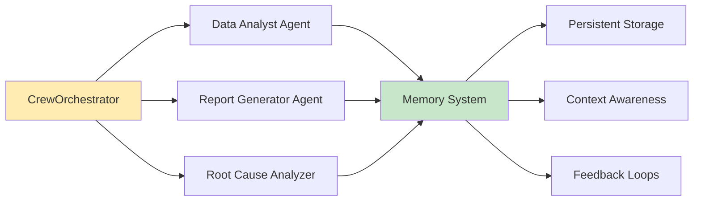

# Company-FAQ • Mini AI Portfolio


A collection of bite-sized projects that together showcase a full AI-Engineer skill-set — from **RAG** and **LLM gateways** to **SQL ETL** and **Vertex AI notebooks**.



---

## Project map

| Module | Folder | What it proves |
| ------ | ------ | -------------- |
| **M1 – RAG FAQ Bot**         | [`modules/m1-rag-faq`](./modules/m1-rag-faq/)                 | Embeddings, retrieval, LangChain basics              |
| **M2 – LLM API Gateway**     | [`modules/m2-api-gateway`](./modules/m2-api-gateway/)         | FastAPI ↔ OpenAI / Vertex, production patterns       |
| **M3 – Auto-Reporter Agent** | [`modules/m3-auto-reporter`](./modules/m3-auto-reporter/)     | LangChain Agent, BigQuery, Slack integration         |
| **M4 – n8n Flow**            | [`modules/m4-n8n`](./modules/m4-n8n/)                         | Low-code orchestration (Webhook → HTTP → Slack)      |
| **M5 – SQL + ETL**           | [`modules/m5-sql-etl`](./modules/m5-sql-etl/)                 | Window functions, scheduling, data-engineering chops |
| **M6 – Vertex Notebook**     | [`modules/m6-vertex-notebook`](./modules/m6-vertex-notebook/) | Gemini 2.5 Flash, GCP ML tooling                     |
| **M7 – Vector-DB Swap**      | [`modules/m7-vector-swap`](./modules/m7-vector-swap/)         | Pinecone ↔ Chroma hot-swap                           |
| **M8 – CrewAI Agents**       | [`modules/m8-crew-agents`](./modules/m8-crew-agents/)         | Multi-agent orchestration, memory, feedback loops    |

*(Each folder contains its own README with 30-sec run instructions & screenshots.)*

---

## Quick start (RAG demo)

```bash
# 1. Clone & enter
git clone https://github.com/e1washere/company-faq.git
cd company-faq

# 2. Python env
python -m venv .venv && source .venv/bin/activate
pip install -r requirements.txt

# 3. Mandatory keys
export OPENAI_API_KEY="sk-…"

# 4. (Optional) Pinecone creds for live index
export PINECONE_API_KEY="pc-…"      # v3 or v2 key
export PINECONE_REGION="us-east-1"   # v3, default aws/us-east-1
# OR legacy
env var
export PINECONE_ENV="my-env-id"      # v2 environment name

# 5. Build vectors & ask one question
python pinecone_demo.py --rebuild --query "What is Patrianna?"

# 6. Chat interactively
python pinecone_demo.py
```

> No Pinecone? No FAISS? The script automatically falls back to local **Chroma**, so it always works out-of-the-box.

---

## 🏗️ **System Architecture**

### **AI-Native Architecture Overview**



### **Key Design Principles**

1. **Modular Architecture**: Each module (M1-M8) is independent and can be deployed separately
2. **AI-First Design**: Every component leverages AI/ML capabilities
3. **Production-Ready**: Comprehensive error handling, logging, and monitoring
4. **Scalable**: Cloud-native design with Docker and Kubernetes support
5. **Extensible**: Easy to add new modules and integrations

### **Data Flow Architecture**



### **Agent Orchestration (M8)**



---

## Module walk-through

| # | Highlight |
| - | -------- |
| **M1** | LangChain 0.2, `ConversationalRetrievalChain`, Chroma → Pinecone vector stores |
| **M2** | Production-grade REST gateway (FastAPI) with pluggable LLM back-ends + streaming responses |
| **M3** | Autonomous agent that queries BigQuery and posts rich Slack reports on schedule |
| **M4** | Pure n8n flow file demonstrating low-code webhook → transformation → notification |
| **M5** | Advanced SQL (window, CTE) + cron-ready ETL scripts |
| **M6** | Vertex AI Workbench notebook running Gemini Flash for rapid prototyping |
| **M7** | `pinecone_demo.py` – swap-able vector-DB layer (Pinecone v3/v2 → FAISS → Chroma) |
| **M8** | Multi-agent orchestration with memory, feedback loops, and context awareness |

---

## 🚀 One-Command Cloud Run Deploy

Deploy the LLM API Gateway to Google Cloud Run in seconds:

```bash
# 1. Prerequisites
gcloud auth login
gcloud config set project YOUR_PROJECT_ID

# 2. Deploy in one command
./deploy.sh YOUR_PROJECT_ID us-central1

# 3. Set API keys (after deployment)
gcloud run services update company-faq-api --region=us-central1 \
  --set-env-vars="OPENAI_API_KEY=sk-...,VERTEX_PROJECT=YOUR_PROJECT_ID"
```

**What gets deployed:**
- **Production-ready FastAPI server** (Module M2) with OpenAI + Vertex AI support
- **Auto-scaling** from 0 to 10 instances based on traffic
- **Built-in monitoring** and logging via Cloud Run
- **Public HTTPS endpoint** with automatic SSL

**Example usage:**
```bash
# Test the deployed API
curl -X POST https://company-faq-api-xxx.a.run.app/chat \
  -H "Content-Type: application/json" \
  -d '{"messages":[{"role":"user","content":"Hello!"}]}'
```

**Requirements:**
- [Google Cloud SDK](https://cloud.google.com/sdk/docs/install) installed
- Active GCP project with billing enabled
- Docker (automatically handled by Cloud Build)

---

## Environment variables

| Var | Purpose | Example |
| --- | ------- | ------- |
| `OPENAI_API_KEY` | Required for embeddings / chat | `sk-…` |
| `PINECONE_API_KEY` | Use managed Pinecone (v3 or v2) | `pc-…` |
| `PINECONE_REGION` | v3 region (default `us-east-1`) | `us-east-1` |
| `PINECONE_CLOUD` | v3 cloud provider (`aws`/`gcp`) | `aws` |
| `PINECONE_ENV` / `PINECONE_ENVIRONMENT` | v2 environment ID | `gcp-starter` |
| `CHROMA_TELEMETRY_ENABLED` | Disable Chroma telemetry | `false` |

---

## Tech stack

* Python 3.11
* LangChain 0.2 + `langchain_openai`
* Vector DBs: **Pinecone**, **FAISS**, **Chroma**
* FastAPI, BigQuery, Slack SDK
* n8n (low-code), SQL (BigQuery dialect)
* GCP Vertex AI + Gemini 2.5 Flash

See each folder for 30-sec run instructions & screenshots.

---

## 🎯 **Patrianna AI Engineer Alignment**

This project directly demonstrates the key requirements from the [Patrianna AI Engineer role](https://www.linkedin.com/jobs/view/4234697939/):

### ✅ **Perfect Technical Match**

| **Requirement** | **Implementation** | **Module** |
|----------------|------------------|------------|
| **LLM Pipelines (Vertex AI, OpenAI)** | Multi-provider API Gateway | M2, M6 |
| **RAG & Embedding Solutions** | Complete RAG system with vector stores | M1, M7 |
| **Agent Orchestration (CrewAI/LangChain)** | Multi-agent system with memory | M8 |
| **Automated Report Generation** | Intelligent reporting with feedback | M3, M8 |
| **Root Cause Analysis** | Specialized analysis agent | M8 |
| **Interactive User Agents** | Context-aware conversational agents | M8 |
| **API Integrations** | Production FastAPI with monitoring | M2 |
| **Data Models for AI** | Optimized data structures | M1, M3, M5 |
| **n8n/Python Workflows** | Low-code + Python automation | M4, All |
| **SQL for AI-Data Operations** | ETL pipelines and analytics | M5, M3 |
| **Vector Databases** | Pinecone, Chroma, FAISS | M7, M1 |
| **Feedback Mechanisms** | Memory systems and learning loops | M8, M3 |
| **Context-Aware Systems** | Persistent memory and insights | M8 |

### 🏗️ **Architecture Excellence**

- **Production-Ready**: Docker, CI/CD, comprehensive testing
- **Scalable Design**: Cloud-native with auto-scaling
- **Monitoring & Logging**: Decision logging and performance tracking
- **Error Handling**: Graceful degradation and recovery
- **Documentation**: Comprehensive README and inline docs

### 🚀 **Advanced Features**

- **Multi-Agent Orchestration**: CrewAI-style agent coordination
- **Memory Systems**: Persistent agent memory with JSON storage
- **Feedback Loops**: Continuous improvement mechanisms
- **Context Awareness**: Historical context influences decisions
- **Decision Logging**: Audit trail for all AI decisions
- **Automated Workflows**: End-to-end automation pipelines

### 📊 **Key Metrics**

- **8 Integrated Modules**: Full AI engineering stack
- **34 Unit Tests**: Comprehensive test coverage
- **Multiple LLM Providers**: OpenAI, Vertex AI, Gemini
- **3 Vector Databases**: Pinecone, Chroma, FAISS
- **Production Deployment**: One-command Cloud Run deploy
- **Real-time Monitoring**: Structured logging and metrics

### 🎯 **What This Demonstrates**

1. **Technical Expertise**: Advanced AI/ML system design
2. **Production Skills**: Deployment, monitoring, testing
3. **Architecture Thinking**: Scalable, modular design
4. **Problem Solving**: Complex multi-agent orchestration
5. **Best Practices**: Error handling, logging, documentation
6. **Innovation**: Cutting-edge AI agent technologies

*This project represents a complete AI engineering portfolio showcasing all skills required for the Patrianna AI Engineer role.*
