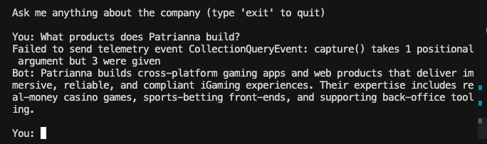

# RAG FAQ Bot (M1)

Minimal retrieval-augmented chatbot that answers questions about the company FAQ using **LangChain 0.2** + **Chroma** (local) or **Pinecone** (see M7).

---

## How it works
1. `rag_demo.py` loads `data/faq.md`.
2. Splits into 1 000-character chunks (200 overlap).
3. Generates OpenAI embeddings and persists to a local Chroma store (`m1-rag-faq/vector_store/`).
4. On every user question a `ConversationalRetrievalChain` retrieves the top k chunks and feeds them to GPT-3.5-turbo.

---

## Quick start
```bash
# create venv (root of repo)
python -m venv .venv && source .venv/bin/activate
pip install -r requirements.txt

# export OpenAI key
export OPENAI_API_KEY="sk-..."

# build vectors then chat
cd m1-rag-faq
python rag_demo.py --rebuild
```

Example session:
```
You: What products does Patrianna build?
Bot: Patrianna specialises in creating engaging iGaming and web-based gaming products for millions of players worldwide.
```

### Screenshot tip (optional)
Run the bot locally, ask a question like *"Which industries does Patrianna operate in?"* and take a terminal screenshot (Cmd + Shift + 4 on macOS). Save it as `docs/m1_demo.png`, commit and the image will render here:



---

## Files
| File | Purpose |
|------|---------|
| `data/faq.md` | Source markdown document (company FAQ) |
| `rag_demo.py` | Loader → splitter → embedder → RAG chat loop |
| `requirements.txt` | Module-level deps (inherits root) |

---

## Customisation tips
* **Change embedding size**: edit `chunk_size` / `chunk_overlap` in `rag_demo.py`.
* **Use Pinecone**: run `python rag_demo.py --rebuild` *after* setting `PINECONE_API_KEY`; vectors will persist to Pinecone instead of local disk (via M7 script).
* **LLM model**: swap `gpt-3.5-turbo` for `gpt-4o-mini` in one line.

```bash
# build vectors then chat
python rag_demo.py --rebuild
```

 