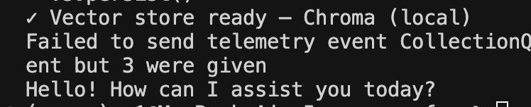

   | **M7 – Vector-DB Swap** | [m7-vector-swap](./m7-vector-swap/) | Pinecone ↔ Chroma hot-swap |
   
   One Python script that decides at runtime which vector store to use:

   | Order | Store | When chosen |
   |-------|-------|-------------|
   | 1     | Pinecone v3 | `PINECONE_API_KEY` present |
   | 2     | Chroma      | fallback when no key |

   ## Run
   ```bash
   cd m7-vector-swap
   python pinecone_demo.py --rebuild --query "What is Patrianna?"
   ```

   Add an interactive chat after the first build:
   ```bash
   python pinecone_demo.py
   ```

   