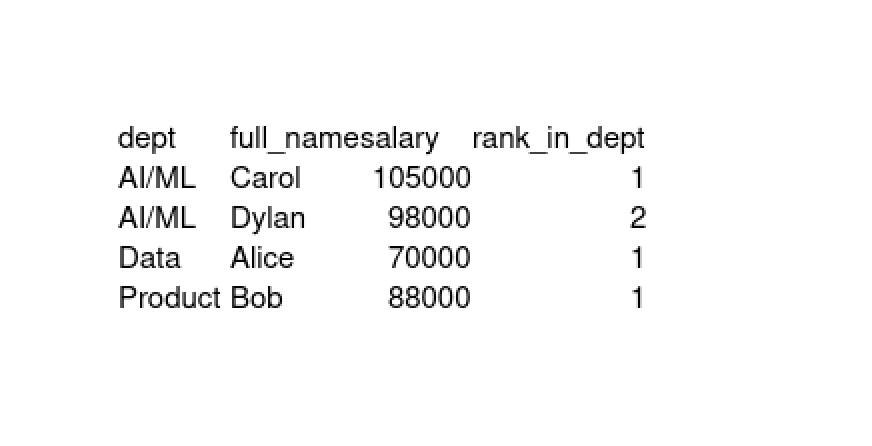

# Mini ETL demo (M5)

*Creates staging table → transforms to final table → simple analytics query
with a window function.*
– see m5_etl_demo.sql

| dept   | full_name | salary | rank_in_dept |
|--------|-----------|--------|--------------|
| AI/ML  | Carol     | 105000 | 1            |
| AI/ML  | Dylan     |  98000 | 2            |
| Data   | Alice     |  70000 | 1            |
| Product| Bob       |  88000 | 1            |

Key things shown:

| Step | Feature                             |
|------|-------------------------------------|
| 1    | `CREATE OR REPLACE TABLE … AS SELECT` with inline data |
| 2    | Window function `RANK() OVER(PARTITION BY … ORDER BY …)` |
| 3    | Final analytic `SELECT` + result grid |

