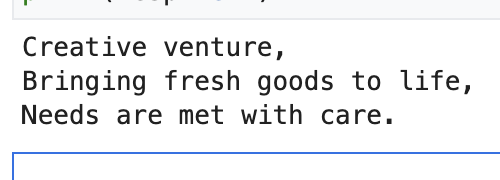

# Vertex AI Notebook (M6)

Lightweight notebook demonstrating Gemini 2.5 Flash prompts inside Vertex AI Workbench.

1. Open Vertex AI Workbench → *New Notebook → Python 3 (CPU, minimal)*.
2. Upload or copy `notebook.ipynb` from this folder.
3. Run all cells; they will load Gemini Flash with project & location set from env vars:
   ```bash
   export VERTEX_PROJECT=<your-project>
   export VERTEX_LOCATION=us-central1
   ```

Outputs show rapid JSON generation and cost metrics. 



If you prefer scripting, run:
```bash
python gemini_flash_demo.py
```

Or convert to a notebook locally:
```bash
pip install jupytext
jupytext --to notebook gemini_flash_demo.py
```